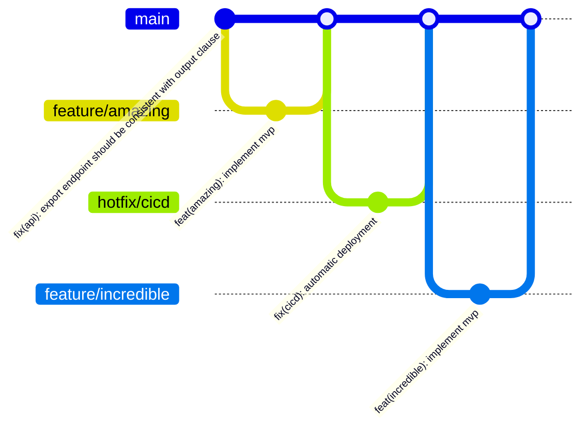

[](https://rollupjs.org/)
[](https://standardjs.com)
[](https://nodejs.org/api/test.html)
[](https://github.com/features/security)
[](https://codeql.github.com/)
[](http://commitizen.github.io/cz-cli/)
[](https://semantic-release.gitbook.io/semantic-release/)
[](https://coveralls.io/)

<p align="center">
  
</p>

# About

`@nagaozen/casbin-mssql-adapter` is a lightweight, high-quality adapter for Casbin, specifically designed for Microsoft SQL Server. Casbin already provides a powerful authorization abstraction with support for multiple adapters. In many cases, adding another layer of abstraction (such as an ORM) can be over-engineering—introducing unnecessary complexity and potential performance issues.

By focusing solely on MSSQL, this adapter delivers:

* **Simplicity**: No extra dependencies or layers—just straightforward SQL interactions optimized for SQL Server.
* **Performance**: Direct, efficient queries without the overhead of an ORM, ensuring your authorization checks remain fast.
* **Rapid Updates**: A focused codebase allows for quicker bug fixes, improvements, and feature updates.
* **High Quality**: A narrow focus enables rigorous testing and stability, making it ideal for production environments with heavy workloads.

This adapter is fully open source and aims to provide a robust, production-ready solution for projects that use Casbin for authorization on Microsoft SQL Server. Contributions, feedback, and improvements are always welcome!

# Features

- [Modern Build Tool](https://rollupjs.org/)
- [Native Assertion Module](https://nodejs.org/api/assert.html)
- [Native Test Runner](https://nodejs.org/api/test.html)
- [Built-in Software Composition Analysis (SCA)](https://github.com/dependabot)
- [Built-in Static Application Security Testing (SAST)](https://codeql.github.com/)
- [Enforced Coding Standard](https://standardjs.com/)
- [Enforced Conventional Commits](https://www.conventionalcommits.org/en/v1.0.0/)
- [Enforced Semantic Release](https://semver.org/)

By default, each adapter creates its own table in the database. While this might seem convenient, it poses a significant drawback when multiple adapters need to share the same database: policies cannot be shared across adapters if they are stored in separate tables.

## Why Customization is important

**Compliance with Naming Conventions:**
Many production databases follow strict naming conventions. By customizing the table name, you can ensure that your adapter’s tables comply with these conventions, which is essential for production environments.

**Shared Policies:**
When the same set of policies should be accessible by different adapters or services, having them in separate tables prevents a unified view. Customizing the table name allows you to consolidate policies into a single table that can be shared across adapters.

**Avoiding Duplication:**
If each adapter creates its own table by default, it can lead to unnecessary duplication of data. This not only wastes storage space but can also lead to inconsistent policy enforcement across different parts of your application.

**Simplified Management:**
With a single, customized table for all policies, managing, updating, and querying policy data becomes much easier. This is especially beneficial in environments where policies need to be audited or maintained centrally.

# Usage

```bash
npm install casbin mssql @nagaozen/casbin-mssql-adapter
```

```javascript
import { newEnforcer } from 'casbin'
import CasbinMssqlAdapter from './adapter.mjs'

const config = process.env.MSSQL_CONNECTION_STRING
const schema = 'dbo'
const table = 'policies'
const adapter = await CasbinMssqlAdapter.newAdapter(config, { table, schema })

const e = await newEnforcer('model.conf', adapter)

// check the permission.
e.enforce('group', 'resource', 'read')

// modify the policy.
// await e.addPolicy(...)
// await e.removePolicy(...)

// no need to call e.savePolicy()
```

# Contributing

We welcome contributions! Contributions are what make the open source community such an amazing place to learn, inspire, and create. Any contributions you make are **greatly appreciated**.

If you have a suggestion that would make this better, please fork the repo, make changes and create a pull request. You can also simply open an issue with the tag "enhancement". Don't forget to give the project a star! Thanks again!

This GitHub repository adheres to the principles of [GitHub Flow](https://docs.github.com/en/get-started/using-github/github-flow) as outlined in the official GitHub documentation. We ensure that all changes are made through branch-based workflows, enabling collaborative development and efficient code review before integration into the main branch.



1. Fork the Project
1. Create your Feature Branch (`git checkout -b feature/amazing`)
1. Commit your Changes (`npm run commit`)
1. Push to the Branch (`git push origin feature/amazing`)
1. Open a Pull Request

# Maintainers

As soon as the maintainers are satisfied with the feature set to be released, they should:

1. Evaluate the quality of the package through the bundle-analyzer report.
1. Run `npm run release`.
1. Confirm if the package is available in npm as the latest version.
1. Notify the maintainers of project embedding this library for faster adoption.

# License

This project is licensed under the Looplex Limited Public License. Feel free to edit and distribute this template as you like.

See [`LICENSE.md`](/LICENSE.md) for more information.

# Acknowledgments
* Special thanks to CEO Angelo Caldeira for enabling this initiative and to our CTO [Fabio Nagao](https://github.com/nagaozen/) who created the framework of this library.
* Shoutout to [looplex contributors](https://github.com/orgs/looplex/people) for their outstanding effort on releasing open source software.

# Useful links
* [README logos](https://stock.adobe.com/br/contributor/208853516/hasan?load_type=author) -- logos repository with the same pattern we are using.
* [Simple Icons](https://simpleicons.org/) -- `shields.io` badges icons and colors.
* [Casbin](https://casbin.org/) -- An authorization library that supports access control models like ACL, RBAC, ABAC for many languages
* [mssql](https://www.npmjs.com/package/mssql) -- Microsoft SQL Server client for Node.js